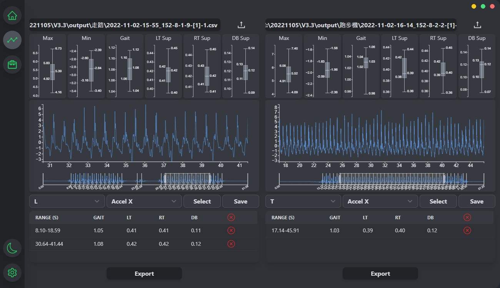

<div align="center">
  
  <h3>Gaitool</h3>
  <p>A human gait analyse tool with Noraxon MR3</p>
  
  
</div>

<div align="center">
  
</div>

## Getting Started (development)

```sh
# install dependencies
yarn

# start dev mode
yarn tauri dev

# build
yarn tauri build
```

## License

TODO
